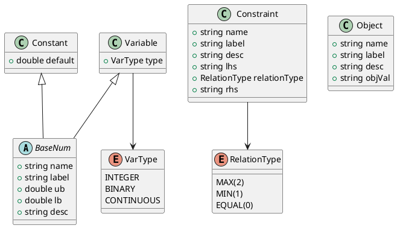

# wx-sober-model
 generate model document

```plantuml
@startuml
abstract class BaseNum {
+string name
+string label
+double ub
+double lb
+string desc
}
class Constant {
+double default
}

class Variable {
+VarType type
}

enum VarType {
INTEGER
BINARY
CONTINUOUS
}

enum RelationType {
MAX(2)
MIN(1)
EQUAL(0)
}

class Constraint {
+string name
+string label
+string desc
+string lhs
+RelationType relationType
+string rhs
}

class Object {
+string name
+string label
+string desc
+string objVal
}

Constant <|-- BaseNum
Variable <|-- BaseNum
Variable --> VarType
Constraint --> RelationType


'abstract class AbstractList
'abstract AbstractCollection
'interface List
'interface Collection
'
'List <|-- AbstractList
'Collection <|-- AbstractCollection
'
'Collection <|- List
'AbstractCollection <|- AbstractList
'AbstractList <|-- ArrayList
'
'class ArrayList {
'Object[] elementData
'size()
'}
'
'enum TimeUnit {
'DAYS
'HOURS
'MINUTES
'}

@enduml
```